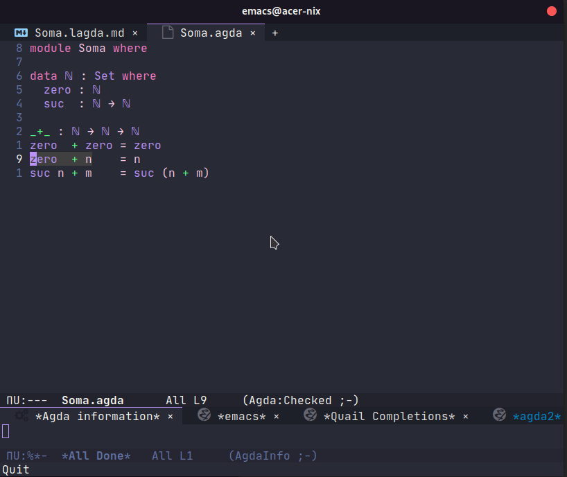
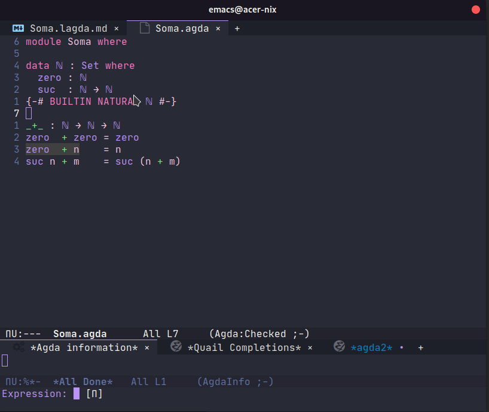
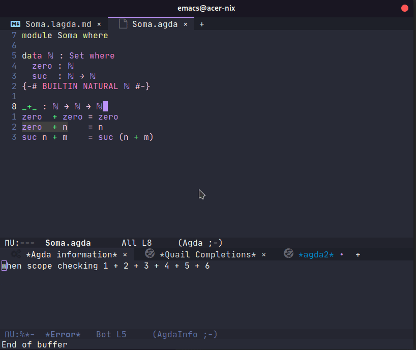

**AARE**: Paradigmas de Linguagem de Programação

**Professor**: Ausberto S. Castro Vera

[ascv@uenf.br](mailto:ascv@uenf.br)

**Data**: 17 de agosto de 2021

**Nome Aluno**: Zoey de Souza Pessanha

---

# Tarefa 01

### 1. Descrição do problema

Faça um programa em qualquer linguagem de programação para que dois números sejam somados.

### 2. Código fonte do programa

```agda
module Soma where

data ℕ : Set where
  zero : ℕ
  suc  : ℕ → ℕ

_+_ : ℕ → ℕ → ℕ
zero  + zero = zero
zero  + n    = n
suc n + m    = suc (n + m)
```

### 3. Telas capturadas mostrando a execução do programa





### 4. Informações adicionais

`Agda` é uma linguagem funcional, com tipos dependentes e um ajuadnde de provas lógicas. Isso significa que os tipos também possuem valores na linguagem. A proposta de `Agda` é que seu programa sempre finaliza com um valor, ou seja, não há erros em tempo de execução, apenas em tempo de compilação.

`Agda` por si só é uma linguagem muito simples. Para ter funcionalidades básicas como números e operadores, é necessário importar a biblioteca padrão.

Primeiramente, crio um módulo `Soma`. Um módulo é formado por um conjunto de definições de tipos e funções. Depois, crio um tipo `ℕ` que representa o tipo dos números naturais. Nesse caso, irei seguir o algoritmo de *Peano*, que torna simples de representá-los apenas com a definição de um valor nulo (zero) e o seu sucessor da seguinte forma:

∀n ∈ ℕ, suc n ∈ ℕ

Para executar o programa, utilizei o `agda-mode` do [emacs](https://www.gnu.org/software/emacs/). Para fazer a checagem do código, basta executar `C-c C-l` e para testar em modo interativo, `C-c C-n`.

Além disso, caso queria usar os construtores de números naturais da bibliotexa padrão da linguagem, adiciona o [pragma](https://agda.readthedocs.io/en/latest/language/pragmas.html#pragmas):

```agda
{-# BUILTIN NATURAL ℕ #-}
```

Isso faz com que os números naturais da biblioteca padrão sejam pertencentes ao nosso tipo `ℕ`.

Main informações sobre os `Peano numbers`, siga para https://wiki.haskell.org/Peano_numbers.
