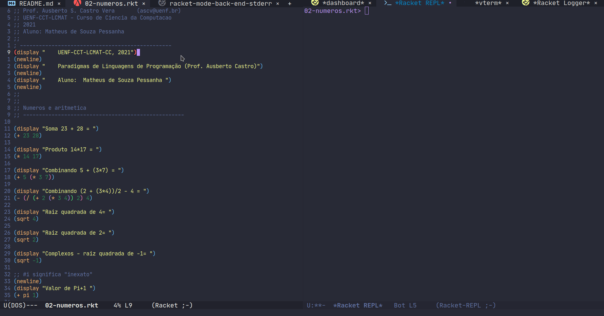
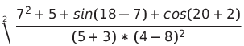

**AARE**: Paradigmas de Linguagem de Programação

**Professor**: Ausberto S. Castro Vera

[ascv@uenf.br](mailto:ascv@uenf.br)

**Data**: 02 de setembro de 2021

**Nome Aluno**: Zoey de Souza Pessanha

---

### 1 - Exeute o arquivo `01-primeiro.rkt`, indique quais funções estão presentes e explique cada uma delas

Arquivo completo [aqui](./01-primeiro.rkt)

Código:
```racket
(begin
  (newline)
  (display "Bom dia, UENF. Bem vindo à Linguagem Racket-Scheme! 2021")
  (newline))
```

`(begin)` -> cria um contexto de expressões

`(display string1)` -> imprime a `string1` dada como argumento em `stdout`

`(new-line)` -> insere uma nova linha (`/n`) no `stdout`

### 2 - Edite o arquivo anterior e imprima "Prática 01 - Linguagem Racket", o nome do aluno e a data atual

Arquivo completo [aqui](./01-primeiro.rkt)

Código:
```racket
(begin
  (newline)
  (display "Bom dia, UENF. Bem vindo à Linguagem Racket-Scheme! 2021")
  (newline)
  (display "Prática -1 - Linguagem Racket")
  (newline)
  (display "Zoey de Souza Pessanha")
  (newline)
  (display "02/09/2021"))
```

### 3 - Execute o arquivo `02-numeros.rkt` e mostre o resultado


### 4 - Escreva  programas Racket para as seguintes expressões:
#### 4.1 - H =  (4 – (7^2 + 6^3) / 3) – (6 + (5 – (2^4 – 8))
Código:
```racket
(- (- 4 (/ (+ (expt 7 2) (expt 6 3)) 3)) (+ 6 (- 5 (- (expt 2 4) 8))))
```
#### 4.2

Código:
```racket
(sqrt (/ (+ (expt 7 2)
	     (+ 5
		    (+ (sin (- 18 7))
			   (cos (+ 20 2))))) (* (+ 5 3) (expt (- 4 8) 2))))
```
