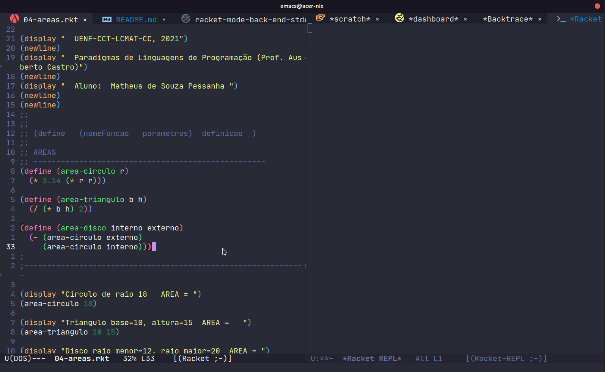
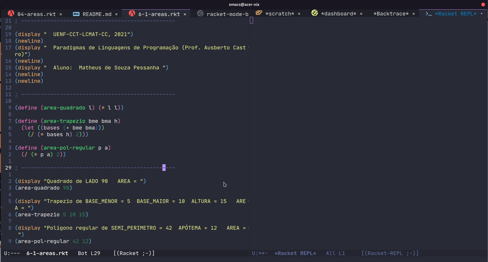
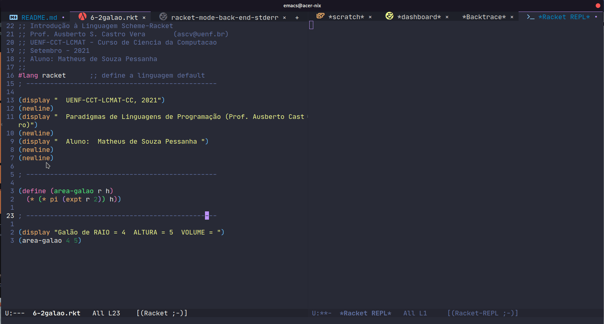
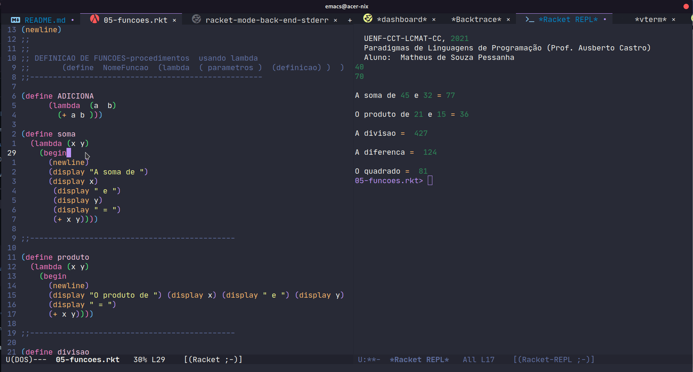
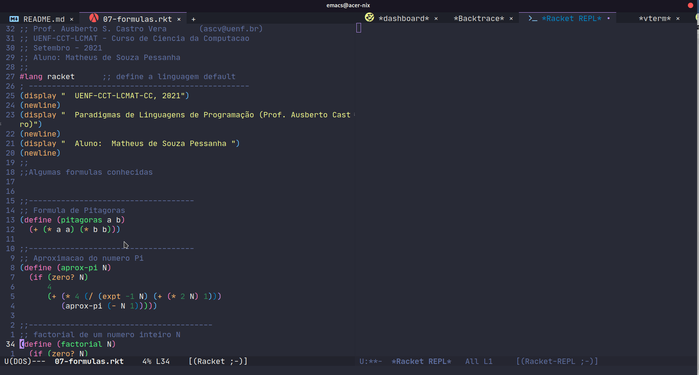
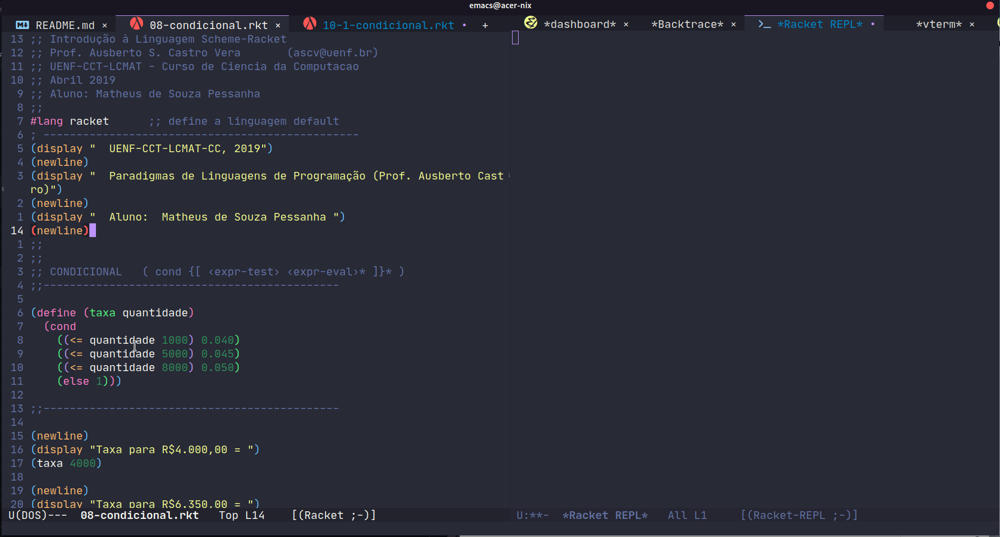
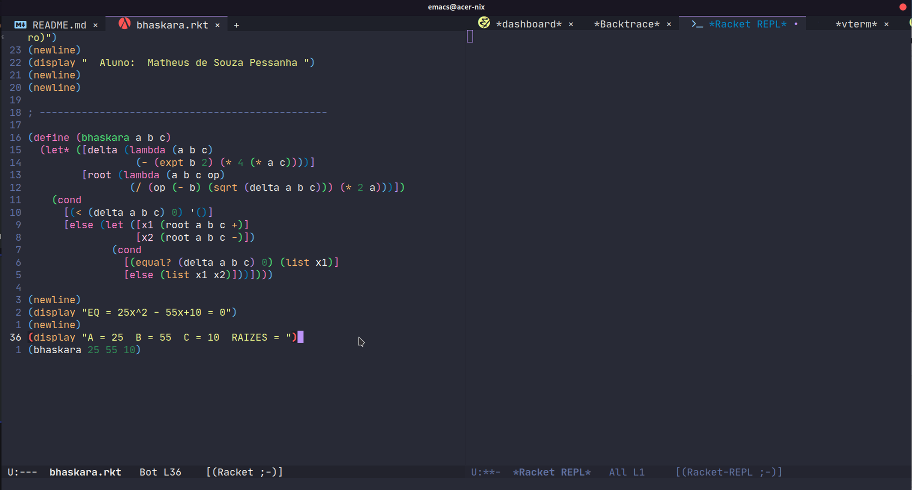

**AARE**: Paradigmas de Linguagem de Programação

**Professor**: Ausberto S. Castro Vera

[ascv@uenf.br](mailto:ascv@uenf.br)

**Data**: 02 de setembro de 2021

**Nome Aluno**: Zoey de Souza Pessanha

---

### 1 - Exeute o arquivo `01-primeiro.rkt`, indique quais funções estão presentes e explique cada uma delas

Arquivo completo [aqui](./01-primeiro.rkt)

Código:
```racket
(begin
  (newline)
  (display "Bom dia, UENF. Bem vindo à Linguagem Racket-Scheme! 2021")
  (newline))
```

`(begin)` -> cria um contexto de expressões

`(display string1)` -> imprime a `string1` dada como argumento em `stdout`

`(new-line)` -> insere uma nova linha (`/n`) no `stdout`

### 2 - Edite o arquivo anterior e imprima "Prática 01 - Linguagem Racket", o nome do aluno e a data atual

Arquivo completo [aqui](./01-primeiro.rkt)

_Código:_
```racket
(begin
  (newline)
  (display "Bom dia, UENF. Bem vindo à Linguagem Racket-Scheme! 2021")
  (newline)
  (display "Prática -1 - Linguagem Racket")
  (newline)
  (display "Zoey de Souza Pessanha")
  (newline)
  (display "02/09/2021"))
```

### 3 - Execute o arquivo `02-numeros.rkt` e mostre o resultado


### 4 - Escreva  programas Racket para as seguintes expressões:
#### 4.1 - H =  (4 – (7^2 + 6^3) / 3) – (6 + (5 – (2^4 – 8))
_Código:_
```racket
(- (- 4 (/ (+ (expt 7 2) (expt 6 3)) 3)) (+ 6 (- 5 (- (expt 2 4) 8))))
```
#### 4.2

_Código:_
```racket
(sqrt (/ (+ (expt 7 2)
	     (+ 5
		    (+ (sin (- 18 7))
			   (cos (+ 20 2))))) (* (+ 5 3) (expt (- 4 8) 2))))
```

### 5

#### 5.1 Explicar o significado de cada uma das 3 expressões  de iteração `let`
_Código:_
```racket
(let ((x 24))
	(+ x 6))
```

_Explicação:_ Criamos uma expresão `let` com o valor inicial de `x` como `24`, depois, somamos `6` ao `x`, resultando em `30`

---

_Código:_
```racket
(let ((a 5) (b 8))
	(+ 3 (* a b)))
```

_Explicação:_ Criamos uma expressão `let` inicializando `a = 5` e `b = 8`, e no corpo da expressão realizamos um cálculo adicionando `3` a multiplicação de `a` e `b`

---

_Código:_
```racket
(let ((op1 +)
      (op2 *)
      (x 5))
	(op1 3 (op2 4 x)))
```

_Explicação:_ Nas expressões de valores da expressão `let`, criamos três valores, dois destes sendo sinônimos para as funções `(+)` e `(*)`. Isso funciona pois em linguagens funcionais, funções são cidadãs de primeria classe, o que significa que podemos passar funções como argumentos, retorná-las de outras funções ou "atribuí-las" a nomes. No corpo da expressão `let` realizo um cálculo que pode ser lido como:

```racket
(+ 3 (* 4 5))
```

#### 5.2 Escreva duas expressões `let` e explique seu significado

```racket
(let* ((x 12)
	   (y (+ x 0.0001)))
	 (equal? x y))
```

_Explicação:_: Crio os valores `x` e `y`, onde o último referencia o primeiro por causa da expressão `let*`, que cria uma nova _localização_ para cada variável e disponibiliza seu valor assim que definido, permitindo o uso em outras variáveis fora dentro do contexto das expressões. Depois verifico se `x`é igual a `y`

---

```racket
(letrec ([! (lambda (b) (b f t))]
	     [t (lambda (a b) a)]
	     [f (lambda (a b) b)])
	 (! f))
```

_Explicação:_ Com uma expressão `letrec` posso criar contextos recursivos que referenciam valores ainda não definidos, pois antes e validar as expressões, todas as _localizações_ das variáveis são criadas antes. Nesse caso implemento uma simples operação booleana com a função `(!)`

---

```racket
(let ((x 2)
	  (y 2)
	  (s +)
	  (p *))
	(if (equal? (s x y) (p x y))
		(print "YAY")
		(print "NOH")))
```

_Explicação:_ Associo o valor `2` a dois nome (`x` e `y`) e crio sinônimos para as funções de soma e produto. No corpo da expressão `let` eu verifico se a aplicação de cada função em `x` e `y` são iguais e imprimo uma mensagem diferente dependendo do resultado

### 6 Execute o arquivo `04-areas.rkt` e explique o resultado


O programa define três funções para cálculos de área das formas:
- Circulo
- Triângulo
- Disco

Por último, o programa aplica cada uma dessas funções a valores, com mensagens impresas na tela para especificar os respectivos valores

#### 6.1 Escreva um programa Racket para calcular a área de um quadrado qualquer, a área de um trapézio e a área de um polígono



Veja o arquivo de [implementação](./6-1-areas.rkt)

#### 6.2 Escreva um programa para calcular o volume de um galão de óleo utilizando a fórmula V = pR^2A, onde as variáveis V, R e A representam, respectivamente, o volume, o raio e a altura



Veja o arquivo de [implementação](./6-2-galao.rkt)

### 7 Execute o arquivo `05-funcoes.rkt` e explique o resultado



O arquivo define seis funções:
- ADICIONA -> apenas soma dois valores
- soma -> imprime na tela uma mensagem descrevendo a soma e depois imprime o resultado dessa soma
- produto -> imprime na tela uma mensagem descritiva sobre a operação, imprime os valores e depois o resultado do produto entre os valores
- divisao -> imprime na tela uma mensagem descrevendo a operação de divisão e depois o resultado do cálculo
- diferenca -> imprime na tela uma descrição da operação e depois seu resultado
- quadrado -> imprime a descrição da operação e logo em seguida seu resultado

Obs: inicialmente as funções `produto`, `divisao`, `diferenca` e `quadrado` estavam calculando a soma na verdade, usando a função `(+)`. Isso é corrigido como pode ser visto no GIF acima

#### 7.1 Escreva um programa onde é definido duas funções

Veja o arquivo de [implementação](./7-1-funcoes.rkt)

### 8 Execute o arquivo `06-condicionalIF.rkt` e explique o resultado


O programa define uma variável `P` com valor `126`, imprime-a na tela e faz uma condicional, verificando se `P` é maior que `57`, se for é impresso uma mensagem dizendo que `P` é maior e no ramo falso, a mensagem é a oposta;

É definidauma função `reply`, que verifica se seu argumento é igual a `"Oi"`, se for, a função responde `"Tudo bem?"`, do contrário responde `"Não entendi."`;

Também é definida uma função de ajuda `quadrado`, para então ser definida a `minquadrado`, que recebe dois argumentos e devolve o quadrado do menor argumento.

#### 8.1 Escreva um programa com dois condicionais

Veja o arquivo de [implementação](./8-1-condicionalIF.rkt)

#### 8.2 Escreva um programa para calcular a media de três notas e indique “Aprovado” se for maior ou igual a 6,0, e “Reprovado”, caso contrário

Veja o arquivo de [implementação](./8-2-condicionalIF.rkt)

### 9 Execute o arquivo `07-formulas.rkt` e explique o resultado



#### 9.1 Escreva uma programa que calcule o fatorial de um número de uma forma diferente da apresentada

Veja o arquivo de [implementação](./9-1-formulas.rkt)

### 10 Execute o arquivo `08-condicional.rkt` e explique o resultado



O programa cria uma expressão `cond` com três ramos onde compara o argumento `quantidade`. Caso algum desses ramos seja verdadeiro, a função retorna a respectiva taxa aplicada aquela quantidade, do contrário devolve `1`.

#### 10.1 Escreva um programa condicional com pelo menos 5 opções

Veja o arquivo de [implementação](./10-1-condicional.rkt)

#### 10.2 Escreva um programa `bhaskara.rkt` que calcule as raízes de uma equação `25x^2 - 55x+10 = 0`, utilizando a fórmula de Bhaskara. Sugestão: Primeiro faça o algoritmo completo



Veja o arquivo de [implementação](./bhaskara.rkt)
